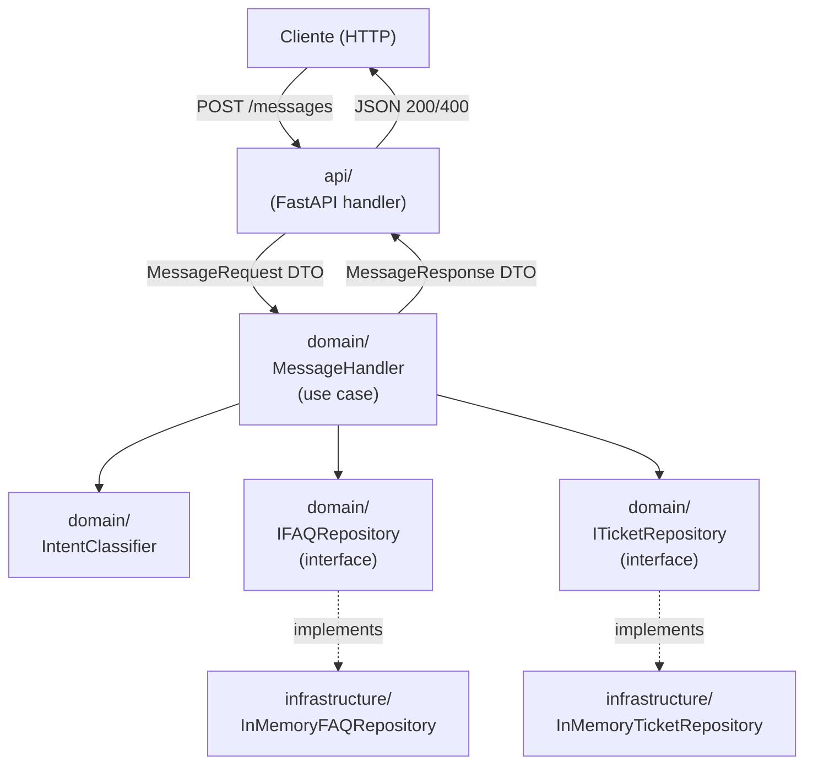
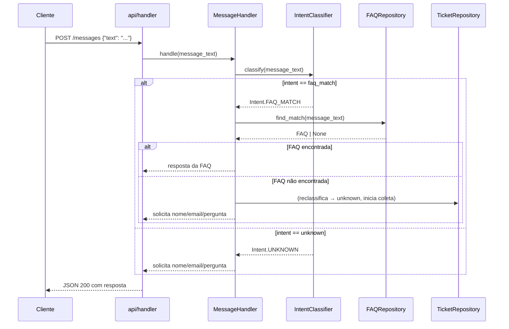

# Design Document — TechStore SupportBot

## Visão Geral

O TechStore SupportBot é um chatbot de suporte ao cliente construído sobre **Clean Architecture** em Python 3.11+. Ele expõe um endpoint HTTP que recebe mensagens de clientes, classifica a intenção, responde com FAQs quando possível e, quando não consegue responder, conduz um fluxo de coleta de dados para abertura de ticket de suporte. Todas as respostas ao cliente são em português (pt-BR).

O design prioriza:
- **Domínio puro**: nenhuma dependência de framework ou I/O na camada de domínio.
- **Testabilidade**: use cases e entidades são testáveis sem mocks de infraestrutura.
- **Extensibilidade**: novos canais (CLI, webhook) podem ser adicionados sem alterar o domínio.

---

## Arquitetura

O sistema segue Clean Architecture com três camadas. As dependências fluem de fora para dentro: `api` → `domain` ← `infrastructure`.



### Fluxo principal de uma mensagem



---

## Componentes e Interfaces

### Camada de Domínio (`domain/`)

#### Entidades e Value Objects

| Componente | Tipo | Responsabilidade |
|---|---|---|
| `Intent` | Enum | `FAQ_MATCH` \| `UNKNOWN` |
| `FAQ` | dataclass | Par pergunta-resposta |
| `Ticket` | dataclass | Nome, e-mail, pergunta, id único |
| `Email` | value object | Encapsula e valida formato de e-mail |
| `ConversationState` | dataclass | Estado da coleta de dados em andamento |

#### Interfaces (Ports)

```python
# domain/ports.py
from abc import ABC, abstractmethod
from domain.entities import FAQ, Ticket

class IFAQRepository(ABC):
    @abstractmethod
    def find_match(self, message: str) -> FAQ | None: ...

    @abstractmethod
    def get_all(self) -> list[FAQ]: ...

class ITicketRepository(ABC):
    @abstractmethod
    def save(self, ticket: Ticket) -> Ticket: ...
```

#### Use Case Principal

```python
# domain/message_handler.py
class MessageHandler:
    def __init__(
        self,
        classifier: IntentClassifier,
        faq_repo: IFAQRepository,
        ticket_repo: ITicketRepository,
    ) -> None: ...

    def handle(self, text: str, state: ConversationState | None) -> HandlerResult: ...
```

`HandlerResult` carrega a resposta em pt-BR e o novo `ConversationState` (ou `None` quando o fluxo está completo).

#### Classificador de Intenção

```python
# domain/intent_classifier.py
class IntentClassifier:
    def classify(self, message: str, faqs: list[FAQ]) -> Intent: ...
```

A classificação usa correspondência por palavras-chave/similaridade simples — sem dependências externas. A lógica pode ser substituída por um modelo de ML na infraestrutura sem alterar o domínio.

### Camada de API (`api/`)

| Componente | Responsabilidade |
|---|---|
| `app.py` | Instância FastAPI, registro de rotas |
| `handlers/message_handler.py` | `POST /messages` — valida entrada, chama `MessageHandler`, formata resposta |
| `schemas.py` | Pydantic DTOs: `MessageRequest`, `MessageResponse` |
| `dependencies.py` | Wiring de dependências (injeção via FastAPI `Depends`) |

### Camada de Infraestrutura (`infrastructure/`)

| Componente | Responsabilidade |
|---|---|
| `faq_repository.py` | `InMemoryFAQRepository` — implementa `IFAQRepository` com FAQs pré-carregadas |
| `ticket_repository.py` | `InMemoryTicketRepository` — implementa `ITicketRepository`, persiste em memória (substituível por DB) |
| `faq_data.py` | FAQs iniciais em pt-BR (entrega, trocas/devoluções, pagamento) |

---

## Modelos de Dados

### `FAQ`

```python
@dataclass(frozen=True)
class FAQ:
    id: str
    keywords: list[str]       # palavras-chave para matching
    question: str             # pergunta canônica em pt-BR
    answer: str               # resposta em pt-BR
```

### `Ticket`

```python
@dataclass
class Ticket:
    id: str                   # UUID gerado na criação
    customer_name: str
    customer_email: str       # validado como Email value object
    original_question: str
    created_at: datetime
```

### `Email` (Value Object)

```python
@dataclass(frozen=True)
class Email:
    value: str

    def __post_init__(self) -> None:
        # valida formato RFC 5322 simplificado
        if not re.match(r"[^@]+@[^@]+\.[^@]+", self.value):
            raise ValueError(f"E-mail inválido: {self.value}")
```

### `ConversationState`

```python
@dataclass
class ConversationState:
    step: Literal["awaiting_name", "awaiting_email", "awaiting_question"]
    original_question: str | None = None
    customer_name: str | None = None
    customer_email: str | None = None
```

### `HandlerResult`

```python
@dataclass
class HandlerResult:
    response_text: str                    # sempre em pt-BR
    new_state: ConversationState | None   # None = fluxo concluído
    ticket: Ticket | None = None          # preenchido quando ticket é criado
```

### Formato JSON da API

**Request:**
```json
{ "text": "Qual o prazo de entrega?" }
```

**Response (200):**
```json
{ "response": "O prazo de entrega padrão é de 5 a 10 dias úteis." }
```

**Response (400):**
```json
{ "error": "O campo 'text' é obrigatório." }
```

### Serialização

FAQs e Tickets são serializados/desserializados via `dataclasses.asdict()` + `json` da stdlib. O `Ticket_Repository` pode persistir em arquivo JSON ou banco de dados; a interface permanece a mesma.

---

## Propriedades de Correção

*Uma propriedade é uma característica ou comportamento que deve ser verdadeiro em todas as execuções válidas de um sistema — essencialmente, uma declaração formal sobre o que o sistema deve fazer. As propriedades servem como ponte entre especificações legíveis por humanos e garantias de correção verificáveis por máquina.*

---

### Propriedade 1: O classificador sempre retorna uma Intent válida

*Para qualquer* mensagem não-vazia, o `IntentClassifier.classify()` SHALL retornar exatamente um dos dois valores: `Intent.FAQ_MATCH` ou `Intent.UNKNOWN` — nunca outro valor, nunca uma exceção.

**Validates: Requirements 1.1**

---

### Propriedade 2: FAQ match retorna a resposta correspondente

*Para qualquer* lista de FAQs e qualquer mensagem que corresponda a uma FAQ dessa lista, o `MessageHandler.handle()` SHALL retornar um `HandlerResult` cujo `response_text` é igual à resposta da FAQ correspondente.

**Validates: Requirements 1.2, 2.2**

---

### Propriedade 3: Intent desconhecida inicia o fluxo de coleta

*Para qualquer* mensagem que não corresponda a nenhuma FAQ (intent `UNKNOWN` ou fallback de `faq_match` sem resultado no repositório), o `MessageHandler.handle()` SHALL retornar um `HandlerResult` com `new_state.step == "awaiting_name"`.

**Validates: Requirements 1.3, 2.5**

---

### Propriedade 4: Mensagens em branco são rejeitadas

*Para qualquer* string composta inteiramente de espaços em branco (incluindo a string vazia), o `MessageHandler.handle()` SHALL retornar um `HandlerResult` com uma mensagem de erro em pt-BR e `new_state == None`.

**Validates: Requirements 1.5**

---

### Propriedade 5: Dados incompletos ou inválidos nunca criam um Ticket

*Para qualquer* `ConversationState` em que pelo menos um dos três campos (nome, e-mail, pergunta) esteja ausente, vazio ou inválido (e.g., e-mail malformado, nome em branco, pergunta em branco), o `MessageHandler.handle()` SHALL não criar um Ticket e SHALL manter o estado de coleta ativo.

**Validates: Requirements 3.2, 3.3, 3.4, 3.5**

---

### Propriedade 6: Dados válidos sempre criam um Ticket com todos os campos

*Para qualquer* combinação válida de nome não-vazio, e-mail bem-formado e pergunta não-vazia, ao completar o fluxo de coleta o `MessageHandler.handle()` SHALL criar um `Ticket` via `ITicketRepository` contendo exatamente esses três valores.

**Validates: Requirements 4.1, 4.2**

---

### Propriedade 7: IDs de Ticket são únicos

*Para qualquer* sequência de N ≥ 2 Tickets criados pelo `ITicketRepository`, todos os IDs atribuídos SHALL ser distintos entre si.

**Validates: Requirements 4.5**

---

### Propriedade 8: Round-trip de serialização de FAQ

*Para qualquer* objeto `FAQ` válido, serializar e depois desserializar SHALL produzir um objeto equivalente ao original (todos os campos iguais).

**Validates: Requirements 5.1, 5.3**

---

### Propriedade 9: Round-trip de serialização de Ticket

*Para qualquer* objeto `Ticket` válido, serializar e depois desserializar SHALL produzir um objeto equivalente ao original (todos os campos iguais).

**Validates: Requirements 5.2, 5.4**

---

### Propriedade 10: Dados corrompidos geram erro descritivo

*Para qualquer* dicionário com campos ausentes ou de tipo incorreto fornecido ao desserializador de `FAQ` ou `Ticket`, o desserializador SHALL levantar uma exceção com mensagem descritiva (não silenciar o erro).

**Validates: Requirements 5.5**

---

### Propriedade 11: Requisições válidas retornam HTTP 200

*Para qualquer* corpo de requisição JSON válido com o campo `"text"` não-vazio, o endpoint `POST /messages` SHALL retornar status HTTP 200 e um JSON com o campo `"response"`.

**Validates: Requirements 6.1, 6.2**

---

### Propriedade 12: Requisições malformadas retornam HTTP 400

*Para qualquer* corpo de requisição ausente, não-JSON ou sem o campo `"text"`, o endpoint `POST /messages` SHALL retornar status HTTP 400 e um JSON com o campo `"error"` descritivo.

**Validates: Requirements 6.3**

---

## Tratamento de Erros

| Situação | Comportamento |
|---|---|
| Mensagem vazia/em branco | Retorna erro em pt-BR, sem alterar estado |
| Nome vazio no fluxo de coleta | Solicita nome novamente, sem criar ticket |
| E-mail inválido no fluxo de coleta | Solicita e-mail novamente, sem criar ticket |
| Pergunta vazia no fluxo de coleta | Solicita pergunta novamente, sem criar ticket |
| `ITicketRepository.save()` lança exceção | Retorna mensagem de erro em pt-BR, sem confirmar abertura de ticket |
| FAQ não encontrada após classificação `faq_match` | Reclassifica como `unknown`, inicia fluxo de coleta |
| Corpo de requisição ausente ou malformado (`POST /messages`) | HTTP 400 com mensagem de erro JSON |
| Desserialização de dado corrompido | Levanta `ValueError` com mensagem descritiva |

Erros de infraestrutura (e.g., falha de I/O no repositório) são capturados na camada de infraestrutura e relançados como exceções de domínio tipadas (`TicketPersistenceError`), mantendo o domínio livre de detalhes de I/O.

---

## Estratégia de Testes

### Abordagem Dual

Os testes combinam **testes unitários** (exemplos concretos, casos de borda) e **testes baseados em propriedades** (cobertura universal via geração de inputs aleatórios).

### Testes Unitários — Camada de Domínio

Cobrem exemplos específicos e casos de borda:
- `IntentClassifier`: mensagem que corresponde a FAQ, mensagem que não corresponde, mensagem vazia.
- `MessageHandler`: cada passo do fluxo de coleta com inputs válidos e inválidos.
- `Email` value object: formatos válidos e inválidos.
- Fallback de `faq_match` sem resultado no repositório.
- Falha do `ITicketRepository` (mock que lança exceção).

### Testes de Propriedade — Camada de Domínio

Utilizar **Hypothesis** (biblioteca de PBT para Python) com mínimo de 100 iterações por propriedade.

Cada teste de propriedade deve ser anotado com:
```python
# Feature: techstore-supportbot, Property N: <texto da propriedade>
@given(...)
@settings(max_examples=100)
def test_property_N_...(...)
```

Propriedades a implementar (ver seção "Propriedades de Correção"):
- **P1**: `st.text(min_size=1)` → resultado sempre em `{FAQ_MATCH, UNKNOWN}`
- **P2**: FAQs geradas + mensagem com keyword → resposta == FAQ.answer
- **P3**: mensagens sem match → `new_state.step == "awaiting_name"`
- **P4**: `st.text(alphabet=st.characters(whitelist_categories=("Zs",)))` → erro retornado
- **P5**: estados com campos inválidos → nenhum ticket criado
- **P6**: `(name, email, question)` válidos → ticket criado com campos corretos
- **P7**: N tickets criados → todos IDs distintos
- **P8**: FAQs geradas → `deserialize(serialize(faq)) == faq`
- **P9**: Tickets gerados → `deserialize(serialize(ticket)) == ticket`
- **P10**: dicts corrompidos → `ValueError` levantado
- **P11/P12**: inputs válidos/inválidos para o endpoint HTTP (via `httpx` + `TestClient`)

### Testes de Integração — Camada de Infraestrutura

- `InMemoryFAQRepository`: verifica FAQs dos três tópicos obrigatórios, busca por keyword.
- `InMemoryTicketRepository`: save e retrieve, unicidade de IDs.
- Endpoint `POST /messages` via `FastAPI TestClient`: smoke test de 200 e 400.

### Estrutura de Arquivos de Teste

```
tests/
├── domain/
│   ├── test_intent_classifier.py
│   ├── test_message_handler.py
│   ├── test_email_value_object.py
│   └── test_properties.py          # todos os testes Hypothesis
├── infrastructure/
│   ├── test_faq_repository.py
│   └── test_ticket_repository.py
└── api/
    └── test_message_endpoint.py
```

### Ferramentas

| Ferramenta | Uso |
|---|---|
| `pytest` | Runner principal |
| `hypothesis` | Testes baseados em propriedades (P1–P12) |
| `httpx` / `FastAPI TestClient` | Testes de endpoint HTTP |
| `unittest.mock` | Mocks de repositório para testes de domínio |
